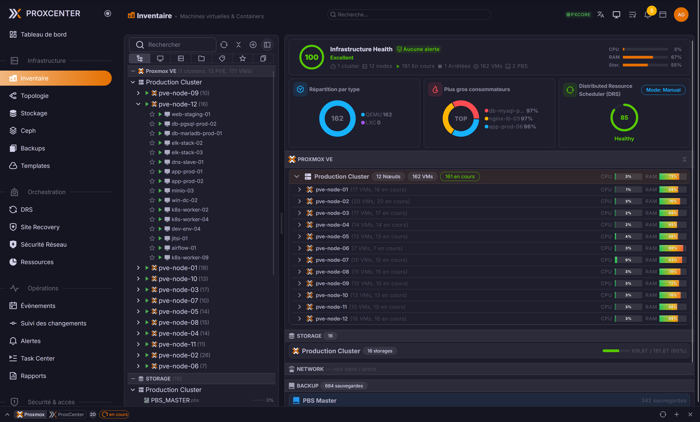
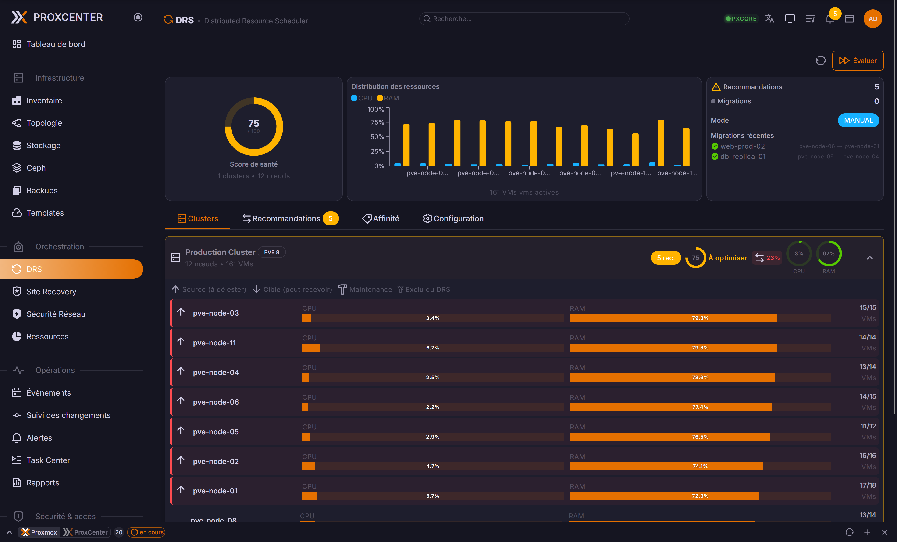
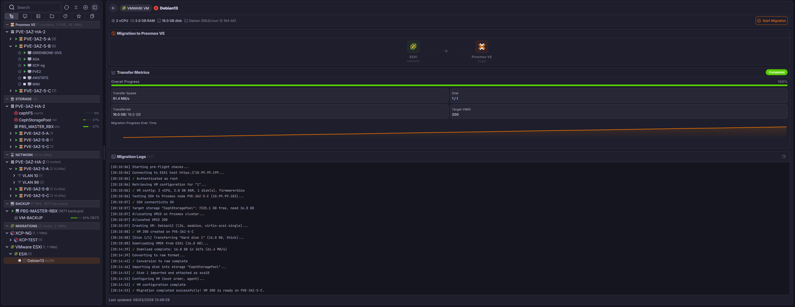
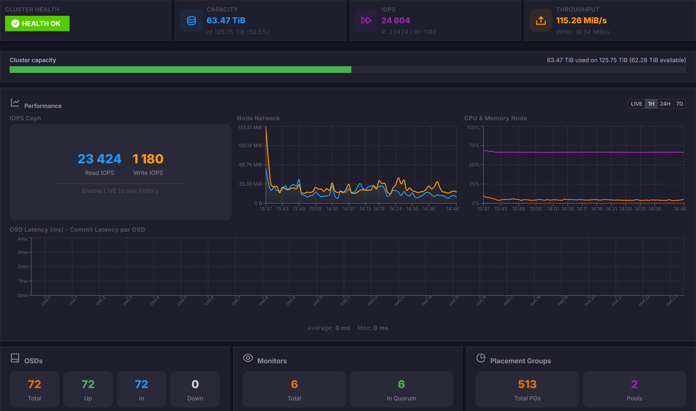
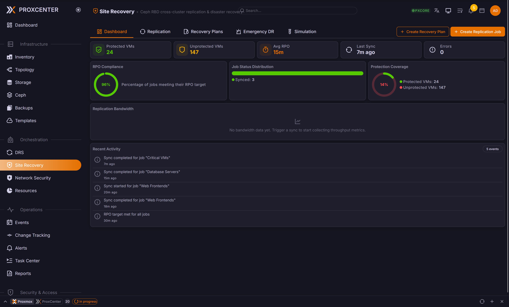
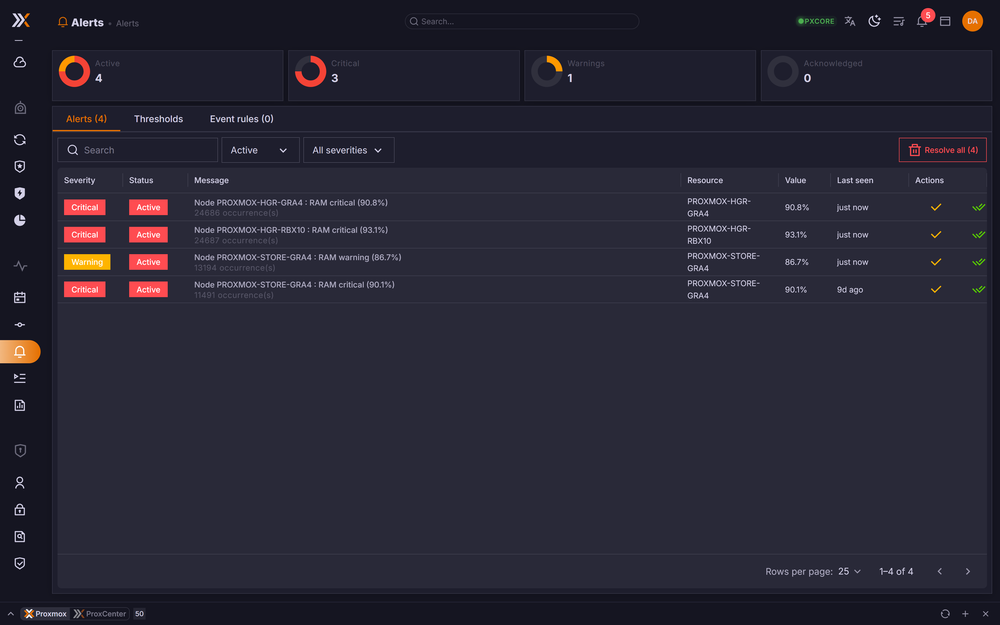
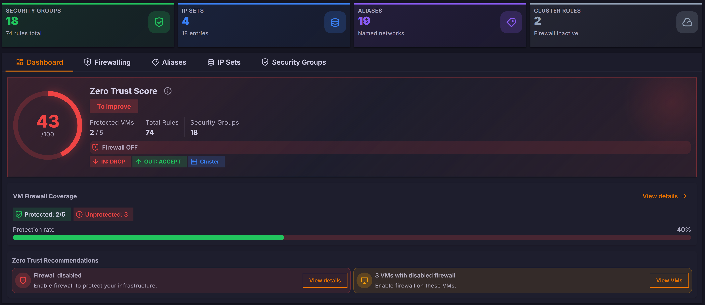
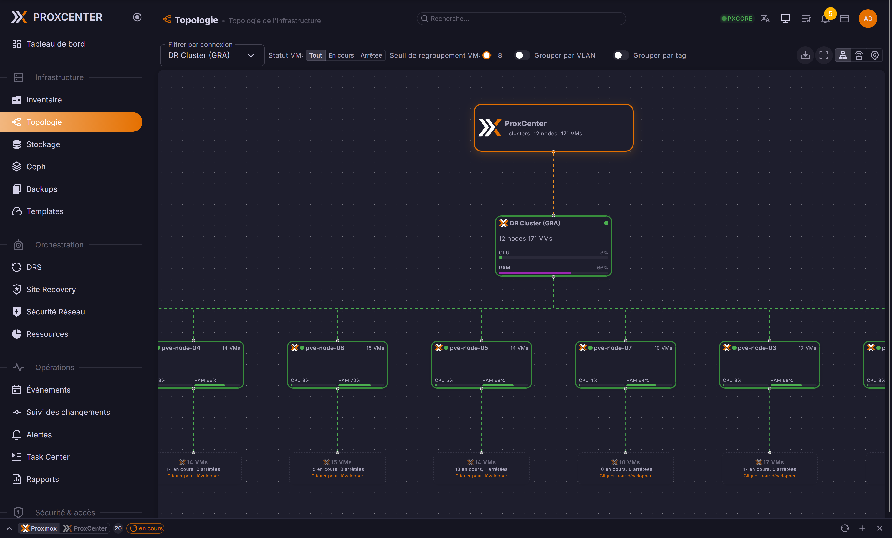

<p align="center">
  <picture>
    <source media="(prefers-color-scheme: dark)" srcset="docs/logo-dark.svg">
    <source media="(prefers-color-scheme: light)" srcset="docs/logo.svg">
    
  </picture>
</p>

<h1 align="center">ProxCenter</h1>

<p align="center">
  <a href="https://www.proxcenter.io/">www.proxcenter.io</a> · <a href="https://demo.proxcenter.io/">Live Demo</a> · <a href="https://docs.proxcenter.io/">Documentation</a>
</p>

<p align="center">
  <strong>Enterprise-grade management platform for Proxmox Virtual Environment</strong>
</p>

<p align="center">
  
  
  <a href="https://github.com/adminsyspro/proxcenter-ui/actions/workflows/codeql.yml"></a>
  <a href="https://github.com/adminsyspro/proxcenter-ui/actions/workflows/security-scan.yml"></a>
  <a href="https://github.com/adminsyspro/proxcenter-ui/stargazers"></a>
</p>

<p align="center">
  <a href="https://sonarcloud.io/summary/overall?id=adminsyspro_proxcenter-ui"></a>
  <a href="https://sonarcloud.io/summary/overall?id=adminsyspro_proxcenter-ui"></a>
  <a href="https://sonarcloud.io/summary/overall?id=adminsyspro_proxcenter-ui"></a>
</p>

---

## Overview

<p align="center">
  <strong>ProxCenter</strong> is a modern web interface for monitoring, managing, and optimizing Proxmox VE infrastructure. Multi-cluster management, cross-hypervisor migration, workload balancing, and more, all from a single pane of glass.
</p>

<p align="center">
  
</p>

---

## Quick Start

```bash
# Community Edition (Free)
curl -fsSL https://proxcenter.io/install/community | sudo bash

# Enterprise Edition
curl -fsSL https://proxcenter.io/install/enterprise | sudo bash -s -- --token YOUR_TOKEN
```

---

## Features

- **Multi-cluster management**: monitor and operate every Proxmox cluster from one console
- **Inventory & topology**: nodes, guests, storage, networks, and the Ceph CRUSH tree at a glance
- **Cross-hypervisor migration**: bring VMs over from VMware, Hyper-V, Nutanix, and XCP-ng, including warm (CBT) migration
- **In-browser consoles**: noVNC and SPICE for QEMU guests
- **Backups & replication**: fleet-wide visibility and reporting
- **RBAC & SSO**: granular roles and scopes
- **DRS workload balancing** *(Enterprise)*: automatic load distribution via the Go orchestrator
- **Alerts, reports & notifications** *(Enterprise)*: email digests, severity routing, and scheduled reports
- **MSP mode** *(Enterprise)*: multi-tenant fleet management with license stacking

See the [documentation](https://docs.proxcenter.io/) for the full feature list and the Community vs Enterprise breakdown.

---

## Screenshots

<table>
  <tr>
    <td width="50%" align="center"><br><sub><b>Modular Dashboard</b></sub></td>
    <td width="50%" align="center"><br><sub><b>DRS Load Balancing</b></sub></td>
  </tr>
  <tr>
    <td width="50%" align="center"><br><sub><b>Hypervisor Migration</b></sub></td>
    <td width="50%" align="center"><br><sub><b>Real-Time Ceph Monitoring</b></sub></td>
  </tr>
  <tr>
    <td width="50%" align="center"><br><sub><b>Site Recovery</b></sub></td>
    <td width="50%" align="center"><br><sub><b>Multi-channel Alerts</b></sub></td>
  </tr>
  <tr>
    <td width="50%" align="center"><br><sub><b>Micro-segmentation (NSX)</b></sub></td>
    <td width="50%" align="center"><br><sub><b>Network Topology Map</b></sub></td>
  </tr>
</table>

---

## Architecture

<p align="center">
  
</p>

- **Single port** (3000): HTTP + WebSocket from one process
- **Nginx optional**: SSL termination and reverse proxy
- **Enterprise** adds a Go orchestrator for DRS, alerts, reports, etc.

---

## Configuration

After install, ProxCenter runs at `http://your-server:3000`.

Files in `/opt/proxcenter/`:
- `.env`: Environment variables
- `config/orchestrator.yaml`: Backend config (Enterprise only)

**Reverse proxy**: Enable the *"Behind reverse proxy"* toggle in connection settings to prevent failover from switching to internal node IPs.

```bash
cd /opt/proxcenter
docker compose logs -f          # View logs
docker compose pull && docker compose up -d  # Update
docker compose restart          # Restart
```

---

## Requirements

- Docker & Docker Compose
- Proxmox VE 8.x or 9.x
- Network access to Proxmox API (port 8006)

## Security

Automated scanning via **CodeQL**, **Trivy**, and **Dependabot**. Report vulnerabilities to [security@proxcenter.io](mailto:security@proxcenter.io).

## License

- **Community**: Free for personal and commercial use
- **Enterprise**: Commercial license

## Support

- Community: [GitHub Issues](https://github.com/adminsyspro/proxcenter-ui/issues)
- Enterprise: [support@proxcenter.io](mailto:support@proxcenter.io)
